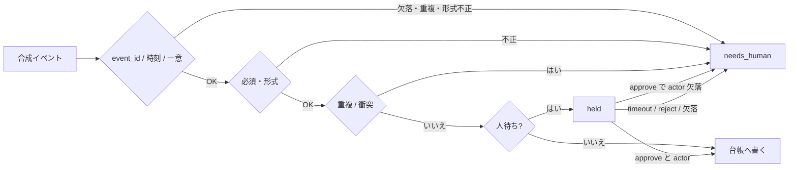

# 見せもの P3 — 失敗停止 / 二重登録ガード（2026-09-16）

> **DRAFT_ONLY。公開しない。応募しない。送信しない。**  
> 合成データ。自主制作。顧客実績・時短・売上の証拠ではない。  
> チケット: `EARN-SHOWCASE-P3-20260916`  
> この PR は **P3 だけ**。P1 / P2 は置かない。

問い合わせや申込を台帳へ書くとき、**二重登録や不正な行になりそうなら止める**見本です。
止めた行は成功件数に混ぜず、`needs_human` として理由を残します。
保留の待ち時間が切れても書きません。**タイムアウトは承認ではありません。**

検品の正本は Python ランナーです。n8n JSON は同じ分岐の見本で、Activate しません。

ルール: [DRAFT_ONLY.md](DRAFT_ONLY.md)  
事実の上限: [FACTS.md](FACTS.md)  
完了条件: [DOD.md](DOD.md)

---

## 何をする / しない

| する | しない |
|---|---|
| 合成イベントログを順に読む | 実顧客・実メール・実 ID を使う |
| 通してよい行だけ台帳へ書く | 二重・衝突・不正を成功扱いにする |
| `event_id`・時刻・approve の actor が無い書き込みを止める | 認証済み承認と名乗る |
| 止めた行を `needs_human` で出す | タイムアウトを approve にする |
| 人が `approve` した保留だけ後から書く | メール / Slack / Sheets へ送る |
| 失敗カタログを before / after で見せる | 精度 %、SLA、時短を名乗る |



```text
合成イベント
  → event_id（非空・一意）と timezone 付き時刻
  → 必須項目・形式
  → 同一キー / 同一顧客の重複
  → 同一ID・別内容の衝突
  → 即時書き込み、または人待ち
  → approve は actor 必須。それ以外（reject / 欠落 / timeout / 不明）は閉じる
```

---

## 動かし方（別担当向け）

Python 3.9+。追加パッケージなし。ネットワークなし。

```bash
cd ops/earn/earn-showcase-p3-failstop-20260916

python3 runner/failstop.py \
  --ledger fixtures/ledger-seed.json \
  --events fixtures/events.jsonl \
  --out-dir /tmp/p3-failstop-out

python3 tests/test_failstop.py
```

標準出力に summary（件数は同梱サンプルの挙動）が出ます。
`/tmp/p3-failstop-out/after-ledger.json` と `after-needs-human.json` を
[examples/](examples/before-after.md) と比べます。

コミット済みの after 例を再生成するとき:

```bash
python3 runner/failstop.py \
  --ledger fixtures/ledger-seed.json \
  --events fixtures/events.jsonl \
  --out-dir examples
```

`examples/before-ledger.json` と `examples/before-after.md` は手で置いてある説明用です。上書きしないでください。ランナーが書くのは `after-*.json` と `summary.json` です。

---

## ファイル

| パス | 役割 |
|---|---|
| `fixtures/ledger-seed.json` | 架空台帳。依頼者A / 依頼者B が既にいる |
| `fixtures/events.jsonl` | 合成イベント 12 行 |
| `fixtures/expected-summary.json` | テストが見る期待結果 |
| `runner/failstop.py` | ガード本体 + CLI |
| `n8n/p3-failstop-double-reg.workflow.json` | inactive な分岐見本（Manual Trigger。認証なし） |
| `examples/before-after.md` | 人が読む before / after |
| `examples/after-*.json` | ランナーが出した例 |
| `FACTS.md` | 主張してよいこと |
| `DOD.md` | 完了条件 |

---

## 失敗カタログ（同梱ログ）

| イベント | 内容 | 結果 |
|---|---|---|
| evt-01 | 依頼者C を新規登録 | **書く** |
| evt-02 | 依頼者A をもう一度 | `needs_human` / `duplicate_registration` |
| evt-03 | メール欠落 | `needs_human` / `invalid_payload` |
| evt-04 | 依頼者B の ID で別メール | `needs_human` / `id_collision` |
| evt-05 | 依頼者C の再送 | `needs_human` / `duplicate_registration` |
| evt-06 | 依頼者D を人待ち | `held`（まだ書かない） |
| evt-07 | D が timeout | `needs_human` / `timeout_not_approve`。**書かない** |
| evt-08 | 依頼者E を人待ち | `held` |
| evt-09 | E を approve | **書く** |
| evt-10 | 依頼者F を人待ち | `held` |
| evt-11 | F を reject | `needs_human` / `rejected`。書かない |
| evt-12 | 名前が空 | `needs_human` / `invalid_payload` |

**After 台帳:** 依頼者A, B, C, E（4 行）。D と F はいない。

---

## n8n を見る場合（任意）

公式の import: https://docs.n8n.io/workflows/export-import/

1. `n8n/p3-failstop-double-reg.workflow.json` を import する
2. **Activate しない**
3. 認証は付けない。後段は NoOp。**Webhook ノードは置かない**（未認証 ingress になるため）
4. 起動は Manual Trigger の見本だけ。外部から受ける形は下の文書のみ

入力の形（合成。Workflow には Webhook を足さない）:

```json
{
  "ledger": { "records": [] },
  "events": []
}
```

n8n の Code ノードは分岐の説明用です。ハッシュ計算も Python と揃えていません。
**DoD は `runner/failstop.py` と `tests/test_failstop.py` だけ見てください。**

---

## 含まないもの

- P1 問い合わせ整理、P2 週報、返信下書き、AI 分類
- 自動返信、自動送信、本番 CRM / Sheets / Slack
- タイムアウト自動承認、認証済み承認、SLA、会社全体の承認基盤
- ブラウザ自動操作、スクレイピング、SNS 運用代行
- 秘密、実 webhook、顧客データ
- 公開、応募、登録追加、Gumroad 公開

売り物の見出しは「確認できる台帳を、壊れる側に倒す」です。
n8n は手段の候補であり、看板固定ではありません。

---

## 英語（短い）

Synthetic fail-stop demo. Duplicate or invalid writes stop and become `needs_human`.
Missing actor / event ID / time, and reused event IDs, do not write.
Timeout is not approve. No secrets. Draft only. P3 only — not P1/P2.
Run `python3 runner/failstop.py` then `python3 tests/test_failstop.py`.
